# 🎵 乐队管理系统用户使用指南

欢迎使用乐队管理系统！本指南将详细介绍如何使用系统的各项功能，帮助您快速上手并充分利用平台的所有特性。  
项目目前开发中，可通过[点击试用](http://47.107.79.244:3000/)访问试用版本（未正式发布，不涉及任何商业用途）  
欢迎加入QQ群讨论：693736489  

---  
> ⚠️ **重要声明**
>
> 本项目源代码仅作为**技术展示和参考**之用。
> - **允许**：浏览、学习、提交 Issue 和讨论。
> - **禁止**：**未经明确授权，严禁克隆、复制、分发或用于任何商业目的。**
> 如有特殊需求，请联系 [3137826052@qq.com]。
>  
---
## 💖特别感谢： 
- 1.[落月API](https://doc.vkeys.cn/api-doc/v2/%E9%9F%B3%E4%B9%90%E6%A8%A1%E5%9D%97/%E7%BD%91%E6%98%93%E4%BA%91%E9%9F%B3%E4%B9%90/1-netease.html)对于音乐盒使用的支持  
- 2.[保罗看板娘插件](https://paul.ren/project/pio)的看板娘为页面带来的活力  
  再次感谢各位开源大佬的帮助🥰
## 📚 目录

- [1. 系统概览](#1-系统概览)
- [2. 用户认证](#2-用户认证)
- [3. 乐队管理](#3-乐队管理)
- [4. 音乐盒功能](#4-音乐盒功能)
- [5. 成员管理](#5-成员管理)
- [6. 活动演出管理](#6-活动演出管理)
- [7. 音乐社区](#7-音乐社区)
- [8. AI音乐顾问](#8-ai音乐顾问)
- [9. 个人资料设置](#9-个人资料设置)
- [10. 管理员功能](#10-仪表盘功能)
- [11. 常见问题](#11-常见问题)

---

## 1. 系统概览

### 1.1 首页介绍

当您首次访问乐队管理系统时，会看到精美的主页界面，展示了系统的核心功能和特色。

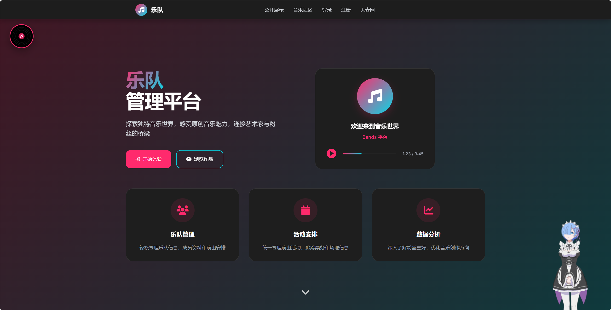

**主页特色功能：**
- 🎨 **现代化设计**：暗色主题配合音乐元素
- 🎵 **功能导航**：快速访问各个功能模块
- 👀 **公开展示**：未登录用户可浏览精选内容
- 🎭 **看板娘交互**：右下角的Live2D动画角色

### 1.2 系统架构

系统采用前后端分离架构，提供：
- **管理员用户**：完整的乐队管理权限
- **普通用户**：只读访问，可以浏览和欣赏音乐内容
- **公开访问**：无需注册即可查看用户公开的内容（在公开页面输入管理员用户名查看）

---

## 2. 用户认证

### 2.1 用户登录

点击导航栏中的"登录"按钮或首页的"开始体验"按钮进入登录页面。

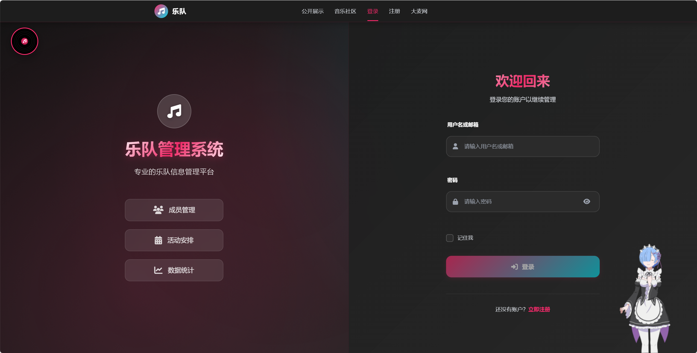

**登录步骤：**
1. 输入用户名或邮箱
2. 输入密码
3. 点击"登录"按钮
4. 系统将验证您的身份并跳转到相应页面

**功能特色：**
- 🔐 **安全认证**：JWT令牌保护用户会话
- 💡 **记住登录**：可选择记住登录状态
- 🎨 **美观界面**：现代化的登录表单设计

### 2.2 管理员注册

如果您是首次使用且需要管理员权限，可以点击"注册"链接。

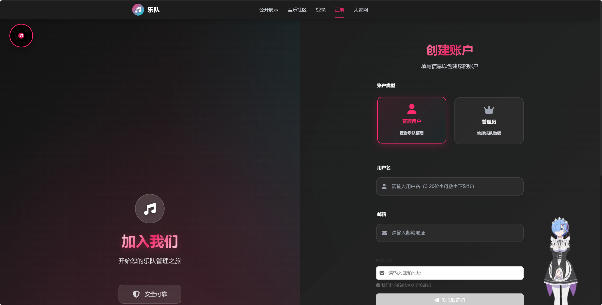

**注册要求：**
1. 📧 **有效邮箱**：用于账户验证和重要通知
2. 🔑 **开发者密钥**：确保只有授权用户可以注册管理员账户
3. 💪 **强密码**：至少8位，包含字母、数字和特殊字符
4. 👤 **显示名称**：在系统中显示的用户名

**注册流程：**
1. 填写注册表单
2. 提供有效的开发者密钥
3. 验证邮箱地址
4. 激活账户后即可登录

---

## 3. 乐队管理（管理员功能）

### 3.1 乐队管理主界面

登录后，管理员用户可以访问乐队管理功能，这是系统的核心模块。

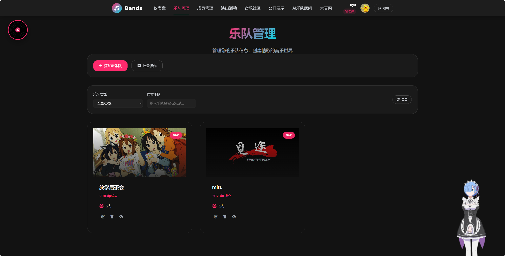

**界面功能介绍：**
- 📋 **乐队列表**：显示所有已创建的乐队
- 🎨 **卡片设计**：每个乐队以精美卡片形式展示
- 🔍 **搜索过滤**：快速找到特定乐队
- ➕ **添加乐队**：点击按钮创建新乐队
- ⚙️ **管理操作**：编辑、删除、查看详情

### 3.2 添加和编辑乐队

点击"添加乐队"按钮或编辑现有乐队时，会弹出功能完整的编辑组件。

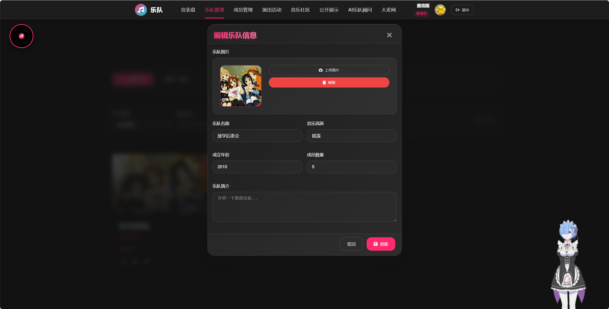

**乐队信息设置：**

1. **基本信息**
   - 🎵 **乐队名称**：必填，乐队的标识名称
   - 📝 **乐队描述**：详细介绍乐队风格、历史等
   - 🏷️ **音乐风格**：摇滚、流行、爵士等分类

2. **视觉设置**
   - 🖼️ **封面图片**：上传乐队代表图片
   - 🎨 **主题色彩**：选择乐队的主色调

3. **联系信息**
   - 📧 **联系邮箱**：用于商务合作
   - 🌐 **官方网站**：乐队官方链接
   - 📱 **社交媒体**：微博、微信等账号

**操作技巧：**
- 💡 **图片要求**：推荐1920x1080像素，格式为JPG/PNG
- 📏 **描述长度**：建议200-500字，突出乐队特色
- 🎯 **风格标签**：准确的标签有助于用户发现

---

## 4. 音乐盒功能（开放功能未注册可用）

音乐盒是系统的特色功能之一，为用户提供沉浸式的音乐体验。

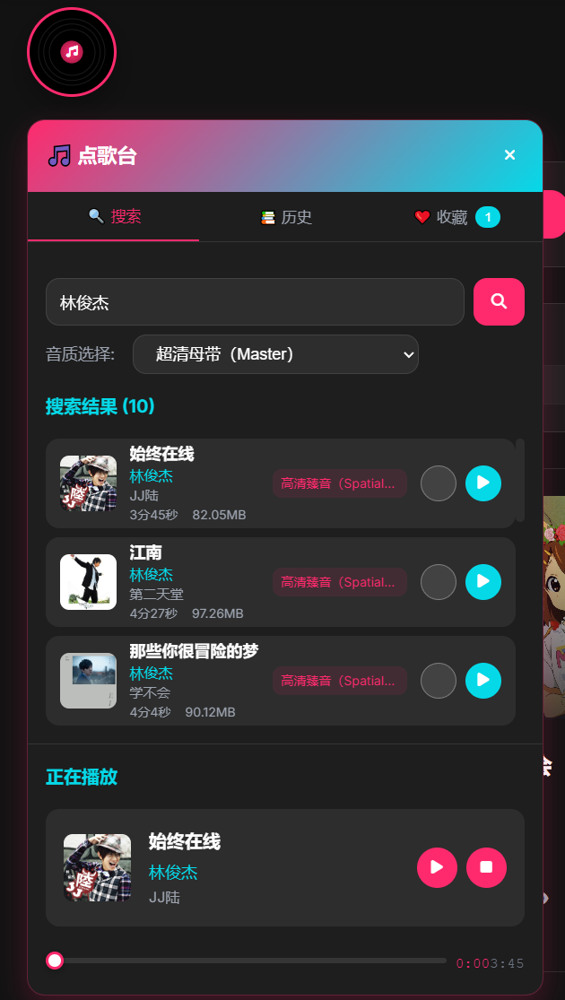

**使用方法：**
1. **播放音乐**：点击播放按钮开始
2. **调节音量**：使用音量滑块
3. **切换歌曲**：上一首/下一首按钮
4. **查看信息**：显示当前播放的歌曲信息

### 4.2 播放列表管理

- 🎼 **播放历史**：保存了用户历史播放音乐
- ❤️ **收藏功能**：收藏喜欢的音乐

---

## 5. 成员管理

### 5.1 成员管理界面

管理乐队成员是乐队管理的重要环节，系统提供了完整的成员管理功能。

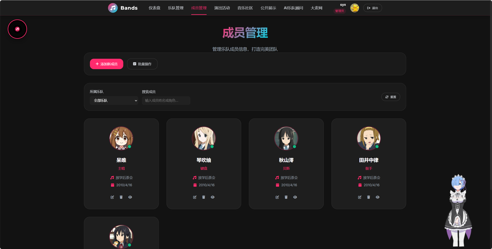

**界面特色：**
- 👥 **成员展示**：网格布局展示所有成员
- 🎭 **角色标识**：清晰显示每个成员的乐队角色
- 📊 **成员统计**：显示成员总数和角色分布
- 🔍 **快速搜索**：按姓名或角色筛选成员

### 5.2 添加和编辑成员

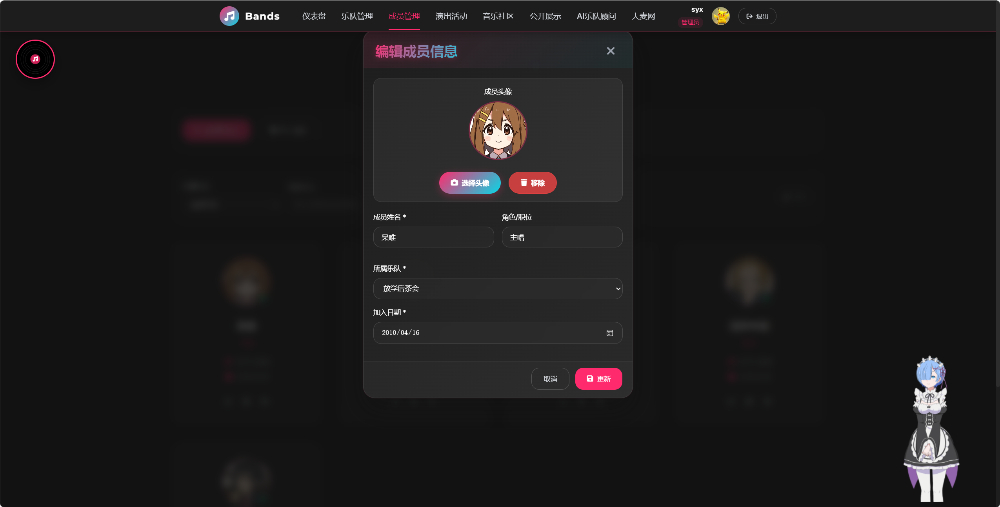

**成员信息管理：**

1. **个人信息**
   - 👤 **姓名**：成员真实姓名或艺名
   - 📧 **邮箱**：联系邮箱地址
   - 📱 **电话**：联系电话号码
   - 🖼️ **头像**：上传成员照片

2. **乐队角色**
   - 🎤 **主唱**：主要声乐演出者
   - 🎸 **吉他手**：电吉他、木吉他演奏者
   - 🎹 **键盘手**：钢琴、合成器演奏者
   - 🥁 **鼓手**：打击乐器演奏者
   - 🎸 **贝斯手**：低音吉他演奏者
   - 🎺 **其他乐器**：萨克斯、小提琴等

3. **技能信息**
   - 🌟 **技能等级**：初级、中级、高级、专业
   - 📅 **加入时间**：成员加入乐队的日期
   - 📝 **个人简介**：成员的音乐背景和特长

**实用技巧：**
- 🎯 **角色分配**：一个成员可以担任多个角色
- 📸 **照片建议**：使用清晰的正面照，便于识别
- 📋 **信息完整性**：完整的信息有助于团队协作

---

## 6. 活动演出管理

### 6.1 活动管理界面

活动演出是乐队重要的展示机会，系统提供专业的活动管理工具。

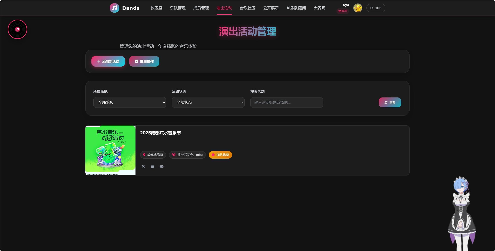

**活动管理功能：**
- 📅 **日历视图**：直观查看活动时间安排
- 🎪 **活动列表**：详细的活动信息展示
- 📊 **状态管理**：筹备中、进行中、已结束
- 🔔 **提醒功能**：重要活动的时间提醒

### 6.2 创建和编辑活动

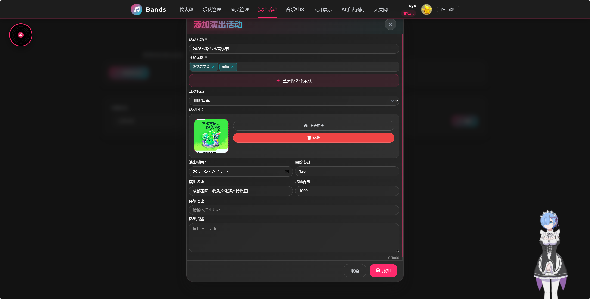

**活动信息设置：**

1. **基本信息**
   - 🎪 **活动名称**：演出或活动的标题
   - 📝 **活动描述**：详细的活动介绍
   - 🏷️ **活动类型**：演出、排练、录音等

2. **时间地点**
   - 📅 **开始时间**：活动开始的日期和时间
   - ⏰ **结束时间**：活动结束的日期和时间
   - 📍 **活动地点**：详细的地址信息
   - 🗺️ **地图定位**：可添加地图坐标

3. **参与管理**
   - 👥 **参与成员**：选择参加活动的成员
   - 🎫 **票务信息**：票价、购票链接等
   - 📢 **宣传信息**：海报、宣传文案等

**活动类型说明：**
- 🎤 **正式演出**：对外公开的表演活动
- 🎵 **排练活动**：内部练习和准备
- 🎬 **录音录像**：音乐作品的录制工作
- 🤝 **商业活动**：商演、代言等商务合作
- 📚 **学习交流**：音乐研讨、技能培训

---

## 7. 音乐社区

音乐社区是用户交流和分享的重要平台，提供丰富的社交功能。

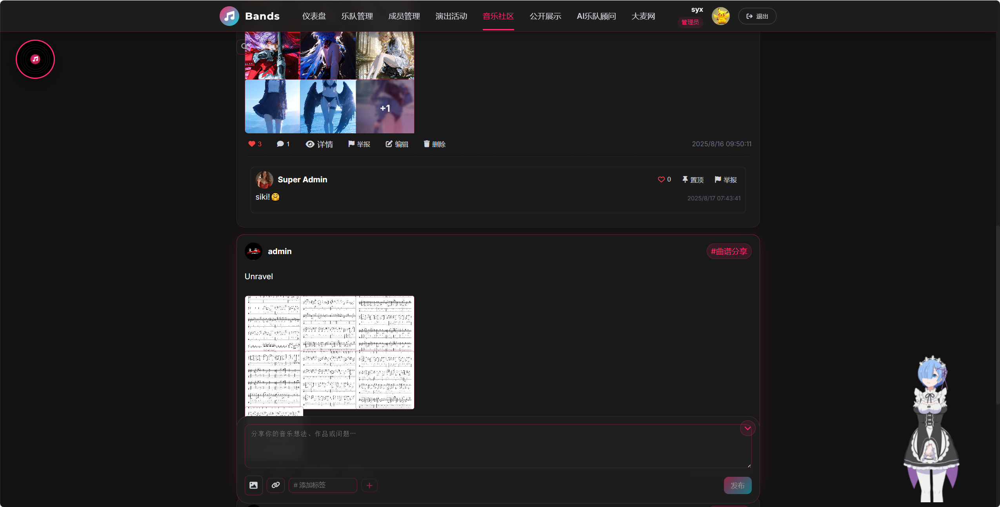

### 7.1 社区功能

**主要特色：**
- 💬 **动态分享**：发布音乐相关的动态和想法
- 🎵 **作品展示**：上传和分享音乐作品
- 👍 **互动功能**：点赞、评论、分享
- 🏷️ **话题标签**：按音乐风格、乐器等分类

### 7.2 社区使用方法

**发布动态：**
1. 点击"发布动态"按钮
2. 编写文字内容
3. 添加图片、音频或视频
4. 选择相关话题标签
5. 发布并与社区成员互动

**互动交流：**
- 💖 **点赞支持**：为喜欢的内容点赞
- 💬 **评论交流**：在评论区分享观点
- 🔄 **转发分享**：将精彩内容分享给更多人
- 👥 **关注用户**：关注感兴趣的音乐人

---

## 8. AI音乐顾问

AI音乐顾问是系统的创新功能，为用户提供智能化的音乐指导。  
**该系统提供的是Deepseek chat和R1模型，用户可自行选择。**

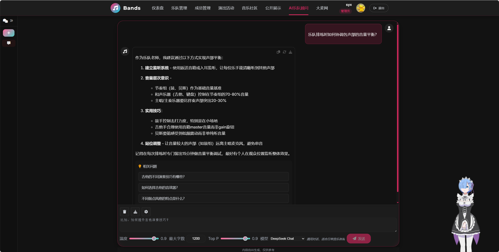

### 8.1 AI功能特色

**核心能力：**
- 🎓 **音乐教学**：提供专业的音乐理论指导
- 🎼 **作曲建议**：协助用户进行音乐创作
- 🎸 **乐器指导**：针对不同乐器的演奏技巧
- 📊 **分析评估**：分析音乐作品并提供改进建议

### 8.2 使用AI顾问

**交互方式：**
1. **文字对话**：输入音乐相关问题
2. **语音交流**：支持语音输入和回复
3. **文件上传**：上传音乐文件获取分析
4. **实时指导**：在线实时的音乐指导

**常见应用场景：**
- 🎵 **学习乐理**："请解释一下大调音阶的构成"
- 🎸 **演奏技巧**："如何提高吉他的扫弦技巧？"
- 🎼 **创作指导**："帮我写一段摇滚风格的副歌"
- 📝 **歌词创作**："为这段旋律配上合适的歌词"

---

## 9. 个人资料设置

### 9.1 个人资料管理

个人资料页面允许用户管理自己的账户信息和公开展示设置。

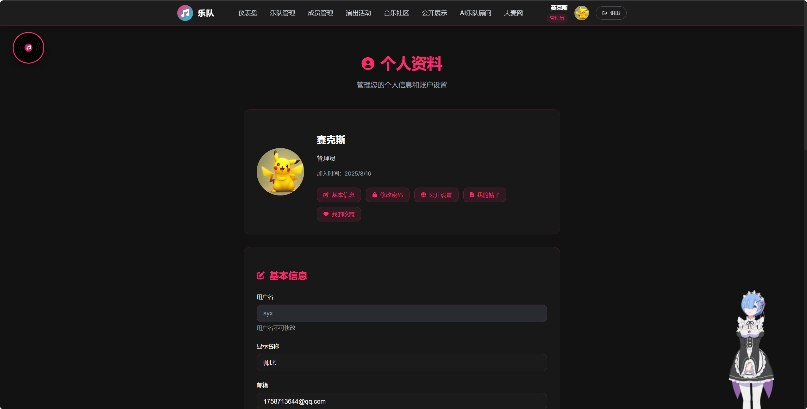

**个人信息管理：**
- 👤 **基本信息**：姓名、邮箱、电话等
- 🖼️ **头像设置**：上传和更换个人头像
- 📝 **个人简介**：音乐背景、技能特长等
- 🎵 **音乐偏好**：喜欢的音乐风格和艺术家

### 9.2 公开设置

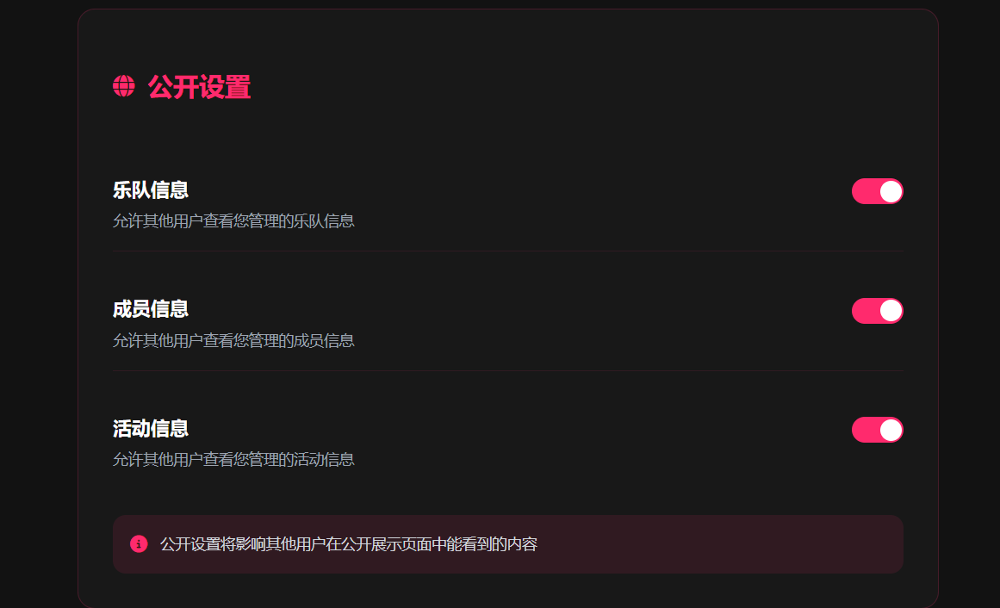

**隐私控制：**
- 🌐 **公开程度**：选择信息的公开范围
- 👁️ **可见性设置**：控制谁可以查看您的资料
- 📧 **联系权限**：设置谁可以联系您
- 🔔 **通知设置**：管理各类通知的接收

### 9.3 公开展示页面

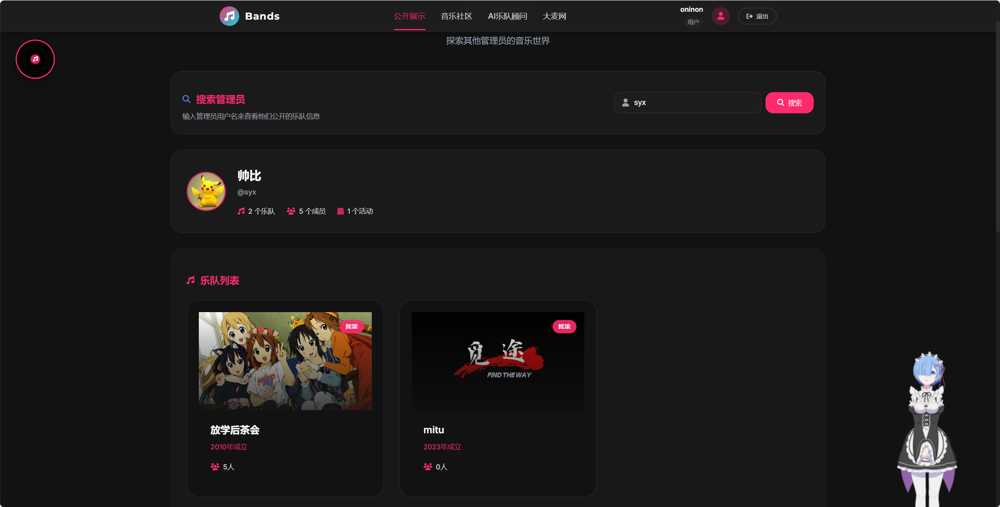   

**如何使用**: 在搜索栏输入管理员的用户名，如果该管理员公开了自己的乐队信息，可以查看到该管理员的乐队、成员或活动信息

**公开页面特色：**
- 🎨 **个性化展示**：展示个人音乐作品和成就
- 🎵 **作品集锦**：精选音乐作品的播放列表
- 📊 **成就展示**：音乐相关的荣誉和认证
- 💬 **访客留言**：允许其他用户留言交流

---

## 10. 管理员功能

管理员拥有系统的高级管理权限，可以访问专门的管理仪表盘。

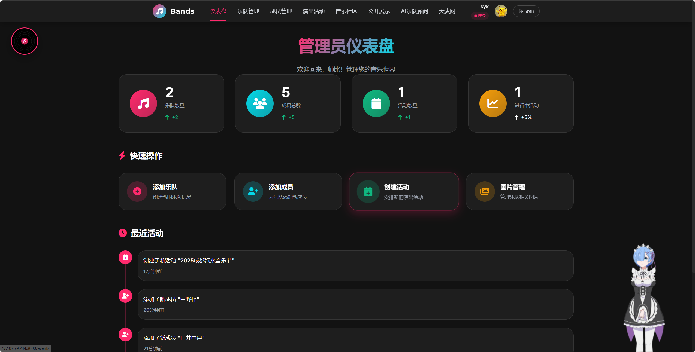

### 10.1 管理仪表盘

**管理功能：**
- 📊 **数据统计**：用户、乐队、活动等关键指标
- 👥 **用户管理**：查看和管理所有用户账户
- 🛠️ **系统设置**：配置系统参数和功能
- 📝 **内容审核**：审核用户发布的内容

---

## 11. 常见问题

### 11.1 账户相关

**Q: 忘记密码怎么办？**
A: 加入QQ群联系管理员重置密码，重置密码为12345678，重置后请及时修改

**Q: 如何更换绑定邮箱？**
A: 暂时不可更换绑定邮箱

**Q: 开发者密钥在哪里获取？**
A: 加入QQ群联系系统管理员获取有效的开发者密钥。

### 11.2 功能使用

**Q: 支持哪些音频格式？**
A: 系统支持MP3、WAV、FLAC、M4A等常见音频格式。

**Q: 上传文件大小有限制吗？**
A: 单个文件最大支持5MB，建议使用压缩后的图片文件。

### 11.3 技术支持

**Q: 遇到技术问题怎么办？**
A: 您可以：
- 查阅系统帮助文档
- 联系技术支持团队
- 在社区论坛发布问题

**Q: 系统支持哪些浏览器？**
A: 推荐使用Chrome、Firefox、Safari、Edge等现代浏览器的最新版本。

---

## 📞 获取帮助

如果您在使用过程中遇到任何问题，可以通过以下方式获取帮助：

- 📧 **邮件支持**：发送邮件到 3137826052@qq.com
- 💬 **在线客服**：暂无
- 📚 **帮助文档**：查阅详细的在线帮助文档
- 🌐 **社区论坛**：在用户社区发布问题和交流经验

---

## 🎉 开始您的音乐之旅

现在您已经了解了乐队管理系统的所有功能，是时候开始您的音乐管理之旅了！

**快速开始建议：**
1. 🔐 **注册并登录**：创建您的管理员账户
2. 🎵 **创建乐队**：添加您的第一个乐队信息
3. 👥 **邀请成员**：将乐队成员添加到系统中
4. 📅 **安排活动**：创建您的第一个演出活动
5. 🎼 **探索功能**：体验音乐盒、社区等特色功能

**温馨提示：** 系统会持续更新和优化，请关注新功能发布和使用指南更新。

愉快的音乐管理体验从这里开始！🎵✨
